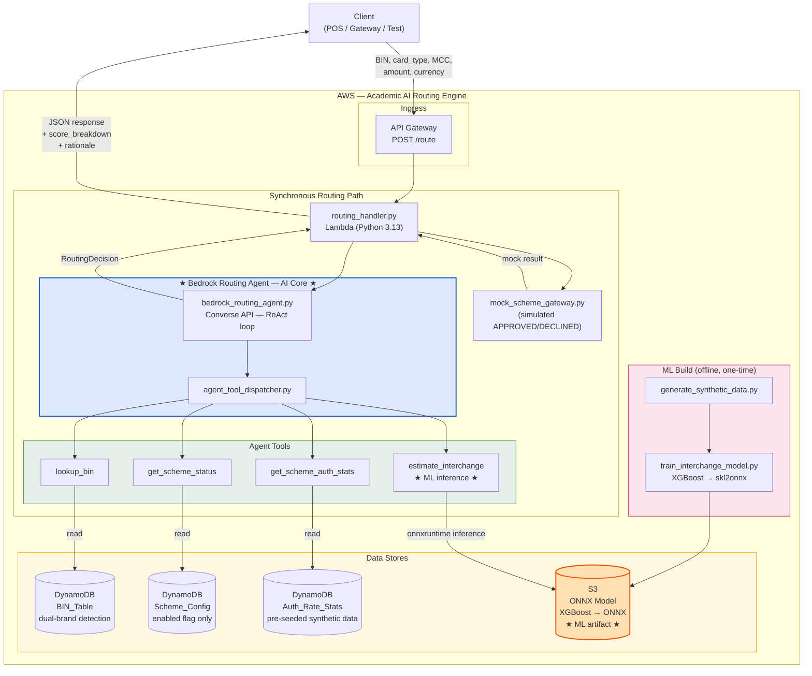
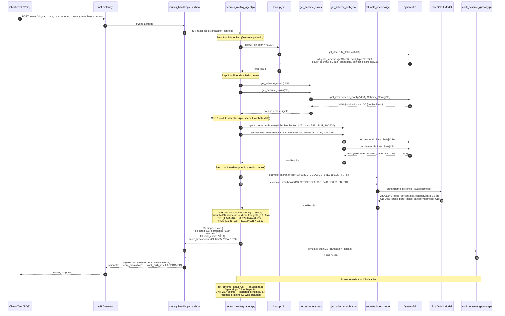

# AI-Driven Payment Scheme Routing Engine
### Academic AI/ML Showcase Project

## Project Overview

This is an **academic AI/ML project** demonstrating intelligent payment scheme routing inside an acquiring bank context. The core contribution is the **agentic AI reasoning loop** that selects the optimal payment scheme (Visa, Mastercard, CB, Discover, UnionPay, Amex, Maestro) for a card transaction by combining LLM tool use with an ML interchange cost model.

**Twin objectives**: maximize authorization rate AND minimize interchange cost — solved as a multi-objective scoring problem by an AWS Bedrock AI agent.

The project showcases:
- **Agentic AI** — AWS Bedrock (Claude) with ReAct tool-use loop
- **ML inference** — XGBoost → ONNX interchange cost model, embedded in Lambda
- **Explainable decisions** — structured JSON output with rationale, confidence, and score breakdown
- **Dual-brand card detection** — BIN-based feature engineering for multi-scheme eligibility

---

## What Was Deliberately Excluded (Academic Scope Decision)

The following production concerns were removed to keep focus on the AI/ML contribution:

| Removed | Reason |
|---|---|
| Circuit breaker system | Operational reliability, not AI/ML |
| Async feedback loop (EventBridge + SQS + StatsUpdaterLambda) | Real-time ops infra; stats are pre-seeded for academic use |
| `POST /outcome` endpoint | Part of feedback loop |
| `Routing_Audit` DynamoDB table | PCI compliance audit trail, not relevant to showcase |
| Auto-retry fallback in RoutingHandler | Operational resilience pattern |
| ML retraining pipeline (Step Functions + SageMaker) | One-time training sufficient for academic demo |
| Live scheme API calls (VisaNet, Banknet, etc.) | Replaced by `MockSchemeGateway` — routing decision is the contribution |
| Scheme_Config operational fields (geo_restrictions, supported_mccs, avg_latency_ms) | Unnecessary complexity |

---

## Requirements

| Dimension | Decision |
|---|---|
| **Engine location** | Inside the acquiring bank — routes to payment brands/schemes |
| **Schemes in scope** | Visa/Visa Debit, Mastercard/Maestro, CB (Cartes Bancaires), Discover, UnionPay, Amex |
| **Dual-brand detection** | BIN lookup — feature engineering input to the AI agent |
| **Primary objectives** | Maximize auth rate + minimize interchange (multi-objective scoring) |
| **AI role** | AWS Bedrock agent — full LLM reasoning with ReAct tool use |
| **Scheme connectivity** | `MockSchemeGateway` — simulated auth response (not the academic contribution) |
| **Interchange data** | XGBoost → ONNX ML model trained on synthetic historical settlement data |
| **Transaction inputs** | BIN, card type, MCC, merchant country, amount, currency |
| **Failure handling** | None — out of scope; `fallback_chain` in agent output documents alternatives |
| **Tech stack** | Python 3.13 Lambda, AWS Bedrock (Converse API), DynamoDB, API Gateway, S3, AWS SAM |
| **Scale** | Academic demo — no TPS target |
| **Compliance** | BIN prefix + last-4 only; no full PAN at any layer |

---

## System Architecture

```
┌──────────────────────────────────────────────────────────────────┐
│          Acquiring Bank — AI Routing Engine (Academic)           │
│                                                                  │
│  Incoming Card Transaction                                       │
│         │                                                        │
│         ▼                                                        │
│  ┌─────────────────┐                                             │
│  │   API Gateway   │  POST /route                               │
│  └────────┬────────┘                                             │
│           │                                                      │
│           ▼                                                      │
│  ┌────────────────────────┐                                      │
│  │   routing_handler      │  Python 3.13 Lambda                 │
│  │   Lambda               │  (thin orchestrator)                │
│  └────────────┬───────────┘                                      │
│               │                                                  │
│  ┌────────────▼────────────────────────────────────┐            │
│  │          BedrockRoutingAgent  ★ AI CORE ★       │            │
│  │  Claude on Bedrock — Converse API — ReAct loop  │            │
│  │  AgentToolDispatcher                            │            │
│  └──┬──────────┬──────────┬────────────────────────┘            │
│     │          │          │                                      │
│  lookup_bin  get_scheme  get_scheme   estimate_interchange       │
│     │        _auth_stats  _status          │                     │
│     ▼          ▼           ▼               ▼                     │
│  DynamoDB   DynamoDB    DynamoDB      S3: ONNX Model             │
│  BIN_Table  Auth_Rate   Scheme_       (XGBoost ML)  ★ ML CORE ★ │
│             _Stats      Config                                   │
│                                                                  │
│  ┌──────────────────────────────────────────────┐               │
│  │  Routing Decision (Explainable AI Output)    │               │
│  │  { selected_scheme, confidence, rationale,   │               │
│  │    fallback_chain[], score_breakdown{} }      │               │
│  └──────────────────────────────────────────────┘               │
│               │                                                  │
│               ▼                                                  │
│  MockSchemeGateway  (simulated auth — not the contribution)     │
└──────────────────────────────────────────────────────────────────┘
```

---

## Dual-Brand Card Detection

A card is dual-branded when its BIN is registered to two or more payment schemes.

1. **BIN Table** stores eligible schemes per BIN prefix (6–8 digits)
2. **BIN data sources**: scheme BIN files (Visa, Mastercard, CB) merged offline into `BIN_Table` seed data
3. **Dual-brand flag**: set when `eligible_schemes` list has ≥ 2 entries
4. **Domestic priority hint**: stored in BIN_Table (`domestic_scheme` field) — CB for FR-issued cards, Discover for US debit; used as a tiebreaker input to the AI agent, not a hard override

---

## DynamoDB Table Design

### `BIN_Table`
| Attribute | Type | Notes |
|---|---|---|
| PK: `bin_prefix` | String | 6–8 digit BIN |
| `eligible_schemes` | List\<String\> | e.g., `["VISA", "CB"]` |
| `card_type` | String | CREDIT / DEBIT / PREPAID |
| `card_product` | String | CLASSIC / GOLD / PLATINUM / INFINITE |
| `issuer_country` | String | ISO 3166-1 alpha-2 |
| `issuer_bank` | String | |
| `dual_brand` | Boolean | true if ≥ 2 eligible schemes |
| `domestic_scheme` | String | Preferred domestic scheme hint (e.g., "CB" for FR) |

### `Scheme_Config`  *(simplified — eligibility only)*
| Attribute | Type | Notes |
|---|---|---|
| PK: `scheme_id` | String | VISA / MASTERCARD / CB / DISCOVER / AMEX / UNIONPAY / MAESTRO |
| `display_name` | String | |
| `enabled` | Boolean | Manual on/off for demo scenarios |

### `Auth_Rate_Stats`  *(pre-seeded synthetic data — not live-updated)*
| Attribute | Type | Notes |
|---|---|---|
| PK: `scheme_id#bin_bucket` | String | e.g., `"VISA#4111"` (first 4 of BIN) |
| SK: `mcc#currency#amount_bucket` | String | e.g., `"5411#EUR#100-500"` |
| `auth_rate_7d` | Number | 7-day approval rate (0.0–1.0) — seeded from synthetic data |
| `auth_rate_30d` | Number | 30-day approval rate |
| `decline_breakdown` | Map | `{ do_not_honor, insufficient_funds, fraud, ... }` |
| `sample_count` | Number | Synthetic sample size |

> **Note**: `Auth_Rate_Stats` is populated once at deploy time from `seed-data/auth-rate-stats.json`. There is no live update mechanism — this is intentional for the academic scope.

---

## Bedrock Agent Design  ★ AI Core

**Model**: `us.anthropic.claude-sonnet-4-6` (cross-region inference profile)
**API**: Converse API with `toolUse` / `toolResult` message blocks
**Region**: `us-east-1` (deployment target — widest Bedrock model availability)
**Pattern**: ReAct (Reason + Act) — agent reasons step-by-step, calls tools iteratively, adapts based on intermediate results

### System Prompt

```
You are an expert payment scheme routing agent for an academic AI/ML research project.

Your job: given a card transaction's attributes, select the optimal payment scheme
(Visa, Mastercard, CB, Discover, UnionPay, Amex, Maestro) to route the authorization to.

You have two competing objectives:
1. MAXIMIZE authorization rate — route to the scheme with the best historical approval
   rate for this card type, MCC, currency, and amount range
2. MINIMIZE interchange cost — route to the scheme with the lowest estimated interchange
   for this transaction profile

Decision process:
Step 1 — Call lookup_bin to identify eligible schemes and detect dual-brand cards
Step 2 — Call get_scheme_status for each eligible scheme; exclude disabled schemes
Step 3 — Call get_scheme_auth_stats for each enabled scheme
Step 4 — Call estimate_interchange for each enabled scheme
Step 5 — Score each scheme: score = (auth_rate × 0.6) - (interchange_pct × 0.4)
          If the transaction has elevated risk signals (high amount, cross-border),
          shift weights to: score = (auth_rate × 0.75) - (interchange_pct × 0.25)
Step 6 — Rank schemes by score. Primary = highest score. Build fallback_chain from remainder.
Step 7 — Return a structured JSON routing decision with full explainability.

Output format (strict JSON, no markdown):
{
  "selected_scheme": "SCHEME_ID",
  "confidence": 0.0-1.0,
  "rationale": "explanation covering dual-brand logic, auth rate comparison, interchange estimate, weight adjustment if any",
  "fallback_chain": [
    { "scheme": "SCHEME_ID", "reason": "why this is ranked #2" }
  ],
  "score_breakdown": {
    "SCHEME_ID": { "auth_rate": 0.94, "estimated_interchange_pct": 0.012, "score": 0.558, "weight_auth": 0.6, "weight_ic": 0.4 }
  }
}

PCI: You will never receive or request a full card number.
Only use BIN prefix (first 6-8 digits) and last-4.
```

### Agent Tools (4 tools)

> `get_scheme_status` is simplified — no circuit breaker fields.

```python
# Tool 1: BIN Lookup
{
  "name": "lookup_bin",
  "description": "Look up card BIN to determine eligible schemes, card type, dual-brand status, and domestic scheme hint",
  "inputSchema": {
    "json": {
      "type": "object",
      "properties": {
        "bin": {"type": "string", "description": "6-8 digit BIN prefix"}
      },
      "required": ["bin"]
    }
  }
  # Returns: eligible_schemes[], card_type, card_product, issuer_country, dual_brand, domestic_scheme
}

# Tool 2: Auth Rate Stats
{
  "name": "get_scheme_auth_stats",
  "description": "Get pre-seeded historical authorization rates for a scheme + card profile",
  "inputSchema": {
    "json": {
      "type": "object",
      "properties": {
        "scheme_id":     {"type": "string"},
        "bin_bucket":    {"type": "string", "description": "First 4 digits of BIN"},
        "mcc":           {"type": "string"},
        "currency":      {"type": "string", "description": "ISO 4217"},
        "amount_bucket": {"type": "string", "enum": ["0-50", "50-200", "200-1000", "1000+"]}
      },
      "required": ["scheme_id", "bin_bucket", "mcc", "currency", "amount_bucket"]
    }
  }
  # Returns: auth_rate_7d, auth_rate_30d, decline_breakdown, sample_count
}

# Tool 3: Interchange Estimation  (ML model)
{
  "name": "estimate_interchange",
  "description": "Estimate the interchange rate for a transaction on a specific scheme using the ONNX ML model",
  "inputSchema": {
    "json": {
      "type": "object",
      "properties": {
        "scheme_id":        {"type": "string"},
        "card_type":        {"type": "string", "enum": ["CREDIT", "DEBIT", "PREPAID"]},
        "card_product":     {"type": "string", "enum": ["CLASSIC", "GOLD", "PLATINUM", "INFINITE"]},
        "mcc":              {"type": "string"},
        "amount":           {"type": "number"},
        "merchant_country": {"type": "string", "description": "ISO alpha-2"},
        "card_country":     {"type": "string", "description": "ISO alpha-2"}
      },
      "required": ["scheme_id", "card_type", "card_product", "mcc", "amount", "merchant_country", "card_country"]
    }
  }
  # Returns: estimated_interchange_pct, interchange_category, confidence, cross_border (bool)
}

# Tool 4: Scheme Status  (simplified)
{
  "name": "get_scheme_status",
  "description": "Check if a scheme is enabled for this demo scenario",
  "inputSchema": {
    "json": {
      "type": "object",
      "properties": {
        "scheme_id": {"type": "string"}
      },
      "required": ["scheme_id"]
    }
  }
  # Returns: enabled (boolean), display_name
}
```

> **Why 4 tools instead of 3**: `get_scheme_status` is kept because it lets the agent demonstrate tool-use reasoning — it may find a scheme disabled mid-loop and adapt its plan. This is more interesting academically than pre-filtering statically.

---

## Interchange ML Model  ★ ML Core

| Property | Detail |
|---|---|
| **Training data** | Synthetic historical settlement data (generated at project setup) |
| **Features** | `scheme_id`, `card_type`, `card_product`, `mcc`, `amount`, `merchant_country`, `card_country`, `cross_border` (bool) |
| **Target** | `interchange_rate` (%) |
| **Algorithm** | XGBoost — interpretable, low inference latency, well-suited to tabular payment data |
| **Export format** | ONNX — runtime-neutral, embedded directly in Lambda (no network hop) |
| **Storage** | S3 bucket; loaded into Lambda memory at cold start via `onnxruntime` Python package |
| **Fallback** | Static `interchange-fallback-rates.json` in Lambda package if model file is unavailable |
| **Retraining** | One-time for academic demo (no scheduler) — model artifact committed to repo under `ml/` |

### Feature Engineering Notes
- `cross_border = (merchant_country != card_country)` — derived feature, significant predictor of interchange tier
- `amount` is used raw (not bucketed) for the ML model; bucketing is only for the DynamoDB stat lookup key
- `mcc` encoded as integer category; unknown MCCs fall back to `0000` (general retail)

---

## Scoring Formula

```
score = (auth_rate_7d × w_auth) - (estimated_interchange_pct × w_ic)

Default weights:     w_auth = 0.6,  w_ic = 0.4
High-risk weights:   w_auth = 0.75, w_ic = 0.25

High-risk signal: amount > 1000 OR cross_border = true
```

The agent applies adaptive weight logic in Step 5 and documents which weights were used in `score_breakdown`.

---

## API Contract

### POST /route

**Request:**
```json
{
  "transaction_id": "uuid",
  "bin": "476173",
  "last4": "9999",
  "card_type": "CREDIT",
  "amount": 150.00,
  "currency": "EUR",
  "mcc": "5411",
  "merchant_country": "FR",
  "card_country": "US"
}
```

**Response (200):**
```json
{
  "transaction_id": "uuid",
  "selected_scheme": "CB",
  "confidence": 0.89,
  "rationale": "Dual-branded Visa/CB card detected (BIN 476173, FR issuer). Both schemes enabled. CB: auth_rate_7d=94.8%, est. interchange=0.9% (domestic FR, CLASSIC CREDIT, MCC 5411). VISA: auth_rate_7d=94.1%, est. interchange=1.5% (cross-border uplift). Default weights applied (amount=150, domestic). CB scores higher (0.565 vs 0.559). Fallback: VISA — strong global auth rate, higher interchange.",
  "fallback_chain": [
    { "scheme": "VISA", "reason": "Second highest score; preferred international fallback for FR dual-brand cards" }
  ],
  "score_breakdown": {
    "CB":   { "auth_rate": 0.948, "estimated_interchange_pct": 0.009, "score": 0.565, "weight_auth": 0.6, "weight_ic": 0.4 },
    "VISA": { "auth_rate": 0.941, "estimated_interchange_pct": 0.015, "score": 0.559, "weight_auth": 0.6, "weight_ic": 0.4 }
  },
  "mock_auth_result": "APPROVED"
}
```

> `mock_auth_result` is returned by `MockSchemeGateway` — always `APPROVED` in the demo unless the scheme is disabled in `Scheme_Config`.

---

## Project Structure

```
payment-routing-engine/
├── requirements.txt                         # Lambda runtime dependencies
├── requirements-dev.txt                     # Dev/test dependencies (pytest, moto, etc.)
├── ml/
│   ├── train_interchange_model.py           # XGBoost training script (run once)
│   ├── generate_synthetic_data.py           # Generates training CSV from interchange rate tables
│   ├── requirements-ml.txt                  # ML-only deps (xgboost, skl2onnx, pandas)
│   ├── interchange_model.onnx               # Pre-trained ONNX artifact (committed)
│   └── model_card.md                        # Features, training data description, accuracy metrics
├── src/
│   ├── handler/
│   │   └── routing_handler.py               # Lambda entry point: event → agent → mock gateway → response
│   ├── agent/
│   │   ├── bedrock_routing_agent.py         # Converse API ReAct loop
│   │   ├── agent_tool_dispatcher.py         # Routes tool calls to service functions
│   │   └── routing_decision_parser.py       # JSON string → validated RoutingDecision dict
│   ├── model/
│   │   ├── transaction_context.py           # Dataclass: BIN, card_type, amount, mcc, etc.
│   │   ├── routing_decision.py              # Dataclass: selected_scheme, confidence, rationale, etc.
│   │   ├── bin_info.py                      # Dataclass: eligible_schemes, dual_brand, etc.
│   │   ├── scheme_config.py                 # Dataclass: scheme_id, enabled, display_name
│   │   ├── auth_rate_stats.py               # Dataclass: auth_rate_7d, auth_rate_30d, etc.
│   │   └── interchange_estimate.py          # Dataclass: estimated_interchange_pct, category, etc.
│   ├── service/
│   │   ├── bin_lookup_service.py            # Calls BinRepository, returns BinInfo
│   │   ├── scheme_status_service.py         # Calls SchemeConfigRepository, returns SchemeConfig
│   │   ├── auth_rate_stats_service.py       # Calls AuthRateStatsRepository, returns AuthRateStats
│   │   └── interchange_estimation_service.py # ONNX model inference via onnxruntime
│   ├── gateway/
│   │   └── mock_scheme_gateway.py           # Returns simulated APPROVED/DECLINED
│   ├── repository/
│   │   ├── bin_repository.py                # DynamoDB get_item on BIN_Table
│   │   ├── scheme_config_repository.py      # DynamoDB get_item on Scheme_Config
│   │   └── auth_rate_stats_repository.py    # DynamoDB get_item on Auth_Rate_Stats
│   └── config/
│       ├── dynamodb_config.py               # boto3 DynamoDB resource + table name env vars
│       ├── bedrock_config.py                # boto3 bedrock-runtime client + model ID
│       └── model_config.py                  # ONNX model loading from S3 at cold start
├── resources/
│   ├── agent-system-prompt.txt
│   └── interchange-fallback-rates.json      # Static fallback if ONNX unavailable
├── infrastructure/
│   ├── template.yaml                        # AWS SAM: Lambda + API GW + DynamoDB + S3
│   └── seed-data/
│       ├── bin-table-sample.json            # ~50 dual-brand BINs (FR, US, DE scenarios)
│       ├── scheme-config.json               # All 7 schemes, all enabled by default
│       └── auth-rate-stats.json             # Pre-seeded synthetic auth rates
└── tests/
    ├── unit/
    │   ├── test_bedrock_routing_agent.py    # Mocked Bedrock tool loop — tests ReAct reasoning
    │   ├── test_interchange_estimation.py   # ONNX inference unit tests
    │   └── test_dual_brand_scenarios.py     # FR Visa+CB, US Discover+MC, DE Visa+MC
    └── integration/
        └── test_routing_integration.py      # moto (DynamoDB mock) + mocked Bedrock client
```

---

## Dependencies

### `requirements.txt` (Lambda runtime)
```
boto3>=1.34.0
onnxruntime>=1.18.0
numpy>=1.26.0
```

### `requirements-dev.txt`
```
pytest>=8.0.0
pytest-cov>=5.0.0
moto[dynamodb,s3]>=5.0.0
```

### `requirements-ml.txt` (ML training only — not deployed to Lambda)
```
xgboost>=2.0.0
skl2onnx>=1.16.0
scikit-learn>=1.4.0
pandas>=2.2.0
numpy>=1.26.0
```

---

## Implementation Phases

### Phase 1 — Data Layer & Seed Data
- DynamoDB tables: `BIN_Table`, `Scheme_Config`, `Auth_Rate_Stats` via SAM
- Seed data: all 7 schemes, ~50 dual-brand BINs covering FR/US/DE scenarios, synthetic auth rate stats
- Repository classes using `boto3` DynamoDB resource
- Dataclass models using Python `dataclasses` module

### Phase 2 — ML Interchange Model
- Generate synthetic training data (`generate_synthetic_data.py`) — covers all scheme/card_type/MCC/country combinations
- Train XGBoost model (`train_interchange_model.py`), export to ONNX via `skl2onnx`
- Store `interchange_model.onnx` in S3 + commit to `ml/` for reproducibility
- `interchange_estimation_service.py` loads model at Lambda cold start via `onnxruntime`
- Write `model_card.md` with feature description and accuracy metrics

### Phase 3 — Bedrock Agent (AI Core)
- `bedrock_routing_agent.py` — Converse API ReAct loop with max 10 iterations
- `agent_tool_dispatcher.py` — routes `toolUse` requests to the 4 service functions
- `routing_decision_parser.py` — strict JSON parsing + validation of agent final output
- System prompt tuning — test dual-brand scenarios, weight adaptation, disabled-scheme handling

### Phase 4 — API, Gateway & Testing
- `routing_handler.py` — validate event → build `TransactionContext` → invoke agent → call `MockSchemeGateway` → return response
- `mock_scheme_gateway.py` — returns `APPROVED` unless scheme is `enabled=False` in Scheme_Config
- SAM template wiring: API GW → Lambda → DynamoDB, S3
- Unit tests: mocked Bedrock responses for all tool-use steps using `pytest`
- Integration tests: `moto` DynamoDB mock + mocked Bedrock client
- Demo scenarios: FR dual-brand (CB wins on interchange), US cross-border (VISA wins on auth rate), disabled scheme fallback

---

## Verification

```bash
# Install SAM CLI dependencies and build
pip install -r requirements.txt
sam build && sam deploy --guided

# Scenario 1: FR dual-brand card (Visa+CB) — expect CB selected (lower interchange)
curl -X POST https://{api-id}.execute-api.eu-west-1.amazonaws.com/prod/route \
  -H "Content-Type: application/json" \
  -d '{
    "transaction_id": "txn-fr-001",
    "bin": "476173",
    "last4": "9999",
    "card_type": "CREDIT",
    "amount": 150.00,
    "currency": "EUR",
    "mcc": "5411",
    "merchant_country": "FR",
    "card_country": "FR"
  }'

# Scenario 2: Cross-border high-value (>1000) — expect high-risk weights applied
curl -X POST https://{api-id}.execute-api.eu-west-1.amazonaws.com/prod/route \
  -H "Content-Type: application/json" \
  -d '{
    "transaction_id": "txn-xb-001",
    "bin": "476173",
    "last4": "9999",
    "card_type": "CREDIT",
    "amount": 2500.00,
    "currency": "USD",
    "mcc": "4722",
    "merchant_country": "US",
    "card_country": "FR"
  }'

# Scenario 3: Disable CB scheme — expect VISA selected as fallback
aws dynamodb update-item --table-name Scheme_Config \
  --key '{"scheme_id":{"S":"CB"}}' \
  --update-expression "SET enabled = :f" \
  --expression-attribute-values '{":f":{"BOOL":false}}'

curl -X POST ... # same FR card — agent should now pick VISA and explain CB was disabled

# Run unit tests
pytest tests/unit/ -v

# Run integration tests
pytest tests/integration/ -v
```

---

## Key Design Decisions

| Decision | Rationale |
|---|---|
| **Python over Java** | Single language across ML training, Lambda inference, and agent — no context switch; faster iteration for academic demo |
| **ONNX over SageMaker endpoint** | No cold-start network hop; model runs inside Lambda memory — keeps p99 < 500ms |
| **`onnxruntime` Python** | Native Python package; simpler API than Java equivalent; excellent XGBoost export support via `skl2onnx` |
| **`dataclasses` for models** | Zero-dependency, typed, readable — avoids Pydantic overhead for a demo project |
| **`moto` for integration tests** | Mocks DynamoDB/S3 locally without real AWS; fast test cycles with no teardown complexity |
| **Pre-seeded stats, no live update** | Removes EventBridge/SQS/StatsUpdater complexity; academic focus is on the AI reasoning, not operational data pipelines |
| **MockSchemeGateway** | Decouples the routing decision (the academic contribution) from real scheme connectivity |
| **ReAct pattern over single-shot prompt** | Agent adapts mid-loop — e.g., finds CB disabled in Step 2, skips Steps 3-4 for CB; this iterative reasoning is the AI showcase |
| **Adaptive weight formula** | Demonstrates multi-objective optimization awareness — high-risk transactions shift preference toward auth rate |
| **`fallback_chain` in output** | Explainability feature — shows the agent's full ranked reasoning, not just the winner |
| **BIN prefix + last-4 only** | Minimum PCI surface; no full PAN anywhere in the system |

---

## Architecture Diagram



---

## Sequence Diagram


