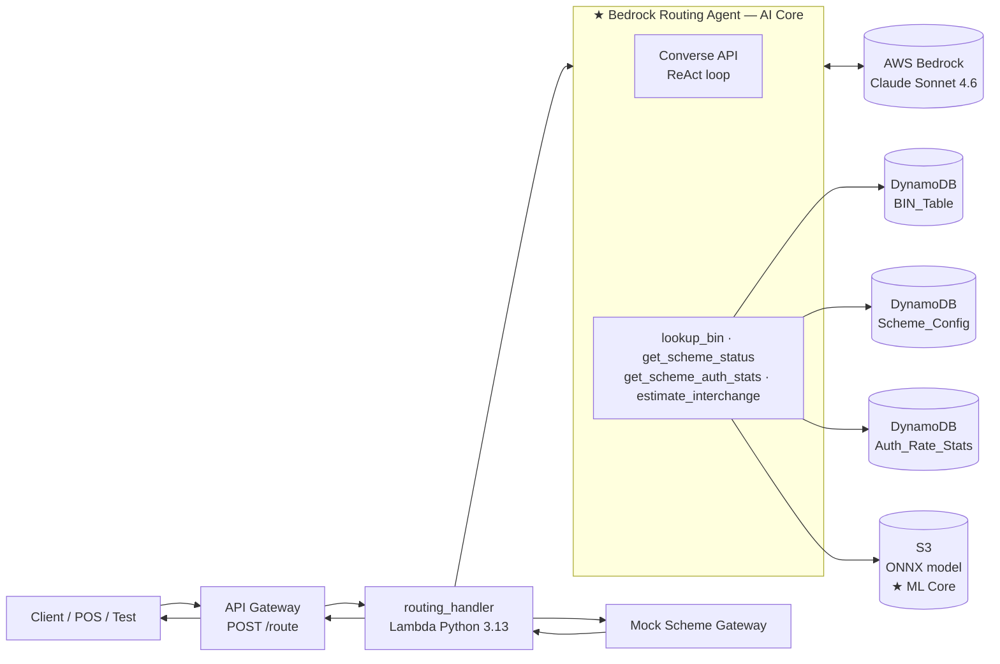

# AI-Driven Payment Scheme Routing Engine

> **Academic AI/ML showcase** — an acquiring-bank routing engine that combines an LLM agent (AWS Bedrock + Claude, ReAct tool-use loop) with an XGBoost interchange cost model to pick the optimal payment scheme for each card transaction. Explainable, multi-objective, end-to-end on AWS serverless.

[](https://www.python.org/downloads/) [](https://aws.amazon.com/bedrock/) [](#testing)

---

## The Problem

When a card is dual-branded (e.g., a French BIN that carries both Visa **and** Cartes Bancaires), the acquiring bank has to decide *which* scheme to route the authorization to. The decision has two competing objectives:

| Objective | What it optimizes for |
|---|---|
| **Maximize authorization rate** | Pick the scheme most likely to *approve* this card / MCC / amount combination |
| **Minimize interchange cost** | Pick the scheme with the lowest fee for this transaction profile |

These objectives conflict often — and the best trade-off depends on transaction context (amount, cross-border, MCC risk, etc.). This project demonstrates how an LLM agent with structured tool use can solve it transparently.

---

## What This Project Demonstrates

- **Agentic AI** — AWS Bedrock (Claude Sonnet 4.6) running a ReAct (*Reason + Act*) loop with 4 tools
- **ML inference inside Lambda** — XGBoost regression → ONNX → `onnxruntime` (no external endpoint, no network hop)
- **Explainable decisions** — every response includes the full rationale, scoring breakdown, and ranked fallback chain
- **Adaptive scoring** — weights shift to favor auth-rate for high-risk transactions (high amount or cross-border)
- **Dual-brand detection** — BIN-table lookup as feature engineering input to the agent
- **End-to-end AWS serverless** — API Gateway → Lambda → DynamoDB / S3 → Bedrock, fully scripted via SAM

---

## Architecture



### How a single routing decision flows

1. **Request** arrives at `POST /route` with `{bin, card_type, amount, currency, mcc, merchant_country, card_country}`
2. Lambda builds a `TransactionContext` and hands it to the agent
3. The agent enters a ReAct loop driven by [resources/agent-system-prompt.txt](resources/agent-system-prompt.txt):
   1. `lookup_bin` → eligible schemes, dual-brand flag, domestic preference
   2. `get_scheme_status` for each eligible scheme (filter out disabled)
   3. `get_scheme_auth_stats` for each enabled scheme
   4. `estimate_interchange` (ML model) for each enabled scheme
   5. **Score** each scheme: `score = (auth_rate × w_auth) − (interchange_pct × w_ic / 100)`
      - default weights `0.6 / 0.4`
      - high-risk weights `0.75 / 0.25` if `amount > 1000` or cross-border
   6. Rank, pick the winner, build the fallback chain
4. The agent emits strict JSON with `selected_scheme`, `confidence`, `rationale`, `fallback_chain`, `score_breakdown`
5. Lambda calls `MockSchemeGateway.simulate_auth()` (returns `APPROVED` unless the scheme is disabled — real scheme connectivity is intentionally out of scope)
6. Final response goes back through API Gateway

---

## Example Request / Response

### Request — FR dual-brand grocery (Visa + CB)
```json
{
  "transaction_id": "txn-fr-001",
  "bin": "476173",
  "last4": "9999",
  "card_type": "CREDIT",
  "amount": 150.00,
  "currency": "EUR",
  "mcc": "5411",
  "merchant_country": "FR",
  "card_country": "FR"
}
```

### Response (illustrative)
```json
{
  "transaction_id": "txn-fr-001",
  "selected_scheme": "CB",
  "confidence": 0.89,
  "rationale": "Dual-branded Visa/CB card detected (BIN 476173, FR issuer). Both schemes enabled. CB: auth_rate_7d=94.8%, est. interchange=0.24% (domestic FR, CLASSIC CREDIT, MCC 5411). VISA: auth_rate_7d=94.1%, est. interchange=0.43% (same profile). Default weights applied (amount=150, domestic). CB scores higher (0.567 vs 0.563). Fallback: VISA — strong international auth, higher interchange.",
  "fallback_chain": [
    { "scheme": "VISA", "reason": "Second highest score; preferred international fallback for FR dual-brand cards" }
  ],
  "score_breakdown": {
    "CB":   { "auth_rate": 0.948, "estimated_interchange_pct": 0.244, "score": 0.567, "weight_auth": 0.6, "weight_ic": 0.4 },
    "VISA": { "auth_rate": 0.941, "estimated_interchange_pct": 0.428, "score": 0.563, "weight_auth": 0.6, "weight_ic": 0.4 }
  },
  "mock_auth_result": "APPROVED"
}
```

---

## The ML Component

The agent's `estimate_interchange` tool is backed by an **XGBoost regression model** trained on synthetic settlement data.

| Property | Value |
|---|---|
| Algorithm | XGBoost (300 trees, depth 6, learning rate 0.08) |
| Features | scheme, card_type, card_product, mcc, amount, merchant_country, card_country, cross_border |
| Target | interchange rate (%) |
| Encoding | One-hot for categoricals (46 features total) |
| Training rows | 25,000 synthetic |
| Export format | ONNX via `onnxmltools` |
| Runtime | `onnxruntime` (Python) loaded into Lambda from S3 at cold start |
| Held-out metrics | MAE 0.039, RMSE 0.054, R² 0.9988 |
| Fallback | Static [resources/interchange-fallback-rates.json](resources/interchange-fallback-rates.json) if model unavailable |

See [ml/model_card.md](ml/model_card.md) for the full model card.

---

## Tech Stack

| Layer | Choice |
|---|---|
| Runtime | Python 3.13 on AWS Lambda |
| LLM | AWS Bedrock — `us.anthropic.claude-sonnet-4-6` (cross-region inference profile) |
| ML | XGBoost → ONNX, served via `onnxruntime` in Lambda |
| Data | DynamoDB (3 tables — BIN_Table, Scheme_Config, Auth_Rate_Stats) |
| Model storage | S3 (ONNX artifact + feature metadata, loaded at cold start) |
| API | API Gateway REST `POST /route` |
| IaC | AWS SAM (CloudFormation under the hood) |
| Testing | `pytest` + `moto` (DynamoDB & S3 mocking) |

---

## Project Structure

```
payment-routing-engine/
├── CLAUDE.md                          # Full design spec (architecture, tool contracts, scoring rules)
├── README.md                          # You are here
├── requirements.txt                   # Lambda runtime deps
├── requirements-dev.txt               # Test deps
│
├── infrastructure/
│   ├── template.yaml                  # SAM template — DDB tables + S3 + Lambda + API GW + IAM
│   ├── seed_loader.py                 # Populates DynamoDB from JSON files
│   └── seed-data/
│       ├── scheme-config.json         # 7 payment schemes
│       ├── bin-table-sample.json      # 17 BINs (FR/US/DE/CN, single + dual-brand)
│       └── auth-rate-stats.json       # 25 pre-seeded auth-rate stats
│
├── ml/
│   ├── requirements-ml.txt            # Training-only deps (xgboost, skl2onnx, etc.)
│   ├── generate_synthetic_data.py     # 25,000 synthetic transactions → CSV
│   ├── train_interchange_model.py     # XGBoost training + ONNX export (+ S3 upload)
│   ├── interchange_model.onnx         # Pre-trained artifact (committed for reproducibility)
│   ├── feature_metadata.json          # Encoder vocabulary for inference-time encoding
│   └── model_card.md                  # Features, training data, metrics, limitations
│
├── resources/
│   ├── agent-system-prompt.txt        # 7-step ReAct decision process + JSON output contract
│   └── interchange-fallback-rates.json
│
├── src/
│   ├── handler/routing_handler.py     # Lambda entry point
│   ├── agent/
│   │   ├── bedrock_routing_agent.py   # Converse-API ReAct loop (max 10 iterations)
│   │   ├── agent_tool_dispatcher.py   # toolUse blocks → service calls
│   │   └── routing_decision_parser.py # Strict JSON parse → RoutingDecision
│   ├── service/                        # Thin wrappers + interchange_estimation_service (ONNX)
│   ├── repository/                     # DynamoDB access (longest-prefix BIN match)
│   ├── model/                          # Dataclasses (TransactionContext, RoutingDecision, etc.)
│   ├── gateway/mock_scheme_gateway.py
│   └── config/                         # boto3 clients + ONNX loader
│
└── tests/
    ├── conftest.py                    # moto DDB + local-ONNX fixtures
    └── unit/                          # 17 tests
```

---

## Quick Start

### Prerequisites
| Tool | Version | Notes |
|---|---|---|
| Python | ≥ 3.13 | |
| AWS CLI | ≥ 2.16 | configured with credentials for an account where you have Bedrock access |
| AWS SAM CLI | ≥ 1.160 | |
| Docker | any recent | needed for cross-platform Lambda build of binary wheels (`onnxruntime`) |
| AWS account | — | with Bedrock model access to Claude Sonnet 4.6 (see [Bedrock access](#bedrock-access)) |

### 1. Clone and install
```bash
git clone https://github.com/alokalok21/payment-routing-engine.git
cd payment-routing-engine

# Lambda runtime + dev deps
pip install -r requirements-dev.txt

# ML training-only deps (only needed if you want to retrain)
pip install -r ml/requirements-ml.txt
```

### 2. (Optional) Retrain the ML model
The pre-trained model at `ml/interchange_model.onnx` is committed and ready to use. If you want to regenerate it:
```bash
python ml/generate_synthetic_data.py
python ml/train_interchange_model.py             # local only
python ml/train_interchange_model.py --upload    # local + upload to S3
```

### 3. Deploy infrastructure
```bash
# Start Docker Desktop first — needed by --use-container for Linux wheels
sam build --template infrastructure/template.yaml --use-container

sam deploy --template infrastructure/template.yaml \
  --stack-name payment-routing-engine \
  --region us-east-1 \
  --capabilities CAPABILITY_IAM \
  --resolve-s3 \
  --no-confirm-changeset \
  --parameter-overrides OnnxBucketName=<your-globally-unique-bucket-name> \
                        BedrockModelId=us.anthropic.claude-sonnet-4-6
```

Note the **`RoutingApiUrl`** output — that's your `POST /route` endpoint.

### 4. Seed DynamoDB and upload the ONNX model
```bash
# Populates BIN_Table, Scheme_Config, Auth_Rate_Stats from seed-data/*.json
python infrastructure/seed_loader.py

# Upload pre-trained ONNX + metadata to S3
aws s3 cp ml/interchange_model.onnx   s3://<your-bucket>/interchange_model.onnx
aws s3 cp ml/feature_metadata.json    s3://<your-bucket>/feature_metadata.json
```

### 5. Test the API
```bash
curl -X POST <RoutingApiUrl> \
  -H "Content-Type: application/json" \
  -d '{
    "transaction_id": "txn-fr-001",
    "bin": "476173",
    "last4": "9999",
    "card_type": "CREDIT",
    "amount": 150.00,
    "currency": "EUR",
    "mcc": "5411",
    "merchant_country": "FR",
    "card_country": "FR"
  }'
```

---

## Demo Scenarios

The full spec in [CLAUDE.md](CLAUDE.md) defines three scenarios that exercise the agent's reasoning:

| Scenario | Transaction | Expected behaviour |
|---|---|---|
| **1. FR dual-brand grocery** | BIN 476173, CREDIT, €150, MCC 5411, FR→FR | CB wins — same auth band as VISA but lower interchange. Default weights (0.6 / 0.4). |
| **2. Cross-border high-value travel** | BIN 476173, CREDIT, $2500, MCC 4722, US→FR | High-risk weights kick in (0.75 / 0.25). VISA should win on stronger cross-border auth rate. |
| **3. CB disabled, retry Scenario 1** | Same as #1 after `aws dynamodb update-item` disables CB in Scheme_Config | Agent calls `get_scheme_status` mid-loop, discovers CB disabled, excludes it from scoring, picks VISA, and explains the exclusion in `rationale`. |

The third scenario is the most interesting — it shows the agent **adapting its plan mid-loop** based on tool output, which is exactly what ReAct is for.

---

## Testing

```bash
python -m pytest tests/ -v
```

| Test file | What it covers |
|---|---|
| [test_routing_decision_parser.py](tests/unit/test_routing_decision_parser.py) | JSON validation, markdown-fence stripping, error cases |
| [test_repositories.py](tests/unit/test_repositories.py) | DynamoDB longest-prefix match, missing items, composite keys (via `moto`) |
| [test_interchange_estimation.py](tests/unit/test_interchange_estimation.py) | ONNX inference tier behaviour, fallback path when model unavailable |
| [test_bedrock_routing_agent.py](tests/unit/test_bedrock_routing_agent.py) | ReAct loop happy path + runaway-loop detection (mocked Bedrock client) |

**17 tests, all passing**, runs in ~7 seconds.

---

## Design Decisions

The most consequential decisions are in CLAUDE.md, but a few highlights:

- **Python over Java** — single language across ML training and Lambda inference; cleaner cold start; less boilerplate
- **ONNX over SageMaker endpoint** — no network hop, p99 latency under 500ms, model runs in-Lambda
- **Pre-seeded auth stats, no live feedback loop** — academic focus is the *routing decision*, not operational telemetry pipelines
- **`MockSchemeGateway`** — real scheme connectivity (VisaNet, Banknet, etc.) is decoupled; not the contribution
- **ReAct pattern over single-shot prompt** — lets the agent adapt mid-loop (e.g., excluding disabled schemes from scoring)
- **Adaptive scoring weights** — high-risk transactions shift preference toward auth rate

What was **deliberately excluded** (and why): circuit breakers, async feedback loop (EventBridge + SQS), live retraining pipeline, audit table, retry/fallback in the handler. Each removed in service of focus.

Full rationale: see the "Key Design Decisions" section of [CLAUDE.md](CLAUDE.md#key-design-decisions).

---

## Bedrock Access

This project requires AWS Bedrock model access for Anthropic Claude models. **New AWS accounts do not have this enabled by default** — you'll see a misleading `ThrottlingException: Too many tokens per day` until you submit the Anthropic use-case-details form via the Bedrock console (Foundation models → any Claude model → look for the use-case-details prompt).

Check current quotas:
```bash
aws service-quotas list-service-quotas --service-code bedrock --region us-east-1 \
  --output json --max-items 300 | jq '.Quotas[] | select(.QuotaName | contains("Claude Sonnet 4.6") and contains("tokens"))'
```

If every `Value` is `0.0`, the use case hasn't been submitted/approved yet. Anthropic typically approves within minutes to a few hours.

---

## License

Academic showcase project — not licensed for production use. See repo for any explicit license file.

---

## Acknowledgements

- AWS Bedrock + the Converse API for first-class tool use
- XGBoost + ONNX Runtime for portable, low-latency tabular inference
- The structured spec in [CLAUDE.md](CLAUDE.md) was used to scope the implementation tightly to the AI/ML contribution and avoid operational sprawl
